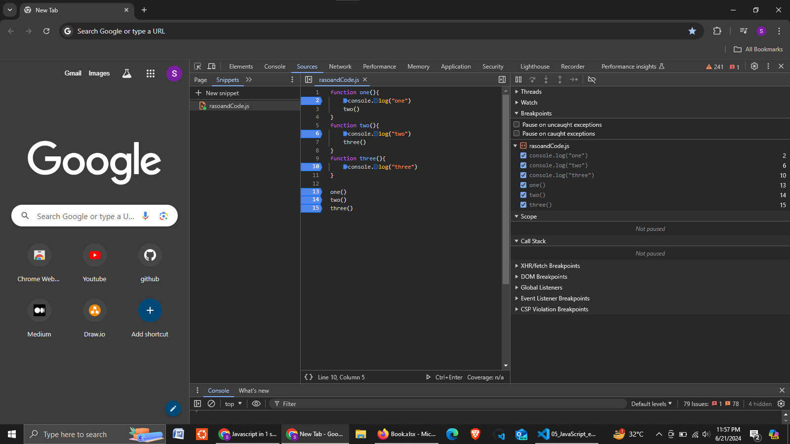

## Javascript Executation context
javaScript is single threaded

1. Global Execution Context
2. Functional/Function Execution Context
3. Eval Executaion Context (It is a property of Global Object)

## How code execute in JavaScript
Code in JS runs in two Phases
1. Memory Creation Phase / Creation Phase   // in this memory is allocated only
2. Execution Phase       

``` 
let val1 = 10
let val2 = 5
function addNum(num1, num2) {
    let total = num1 + num2
    return total
}
let result1 = addNum(val1, val2)
let result2 = addNum(10, 2)
```

**Phase 1:** Global Execution / Environment

located in `this`

**Phase 2:** Memory Creation Phase
val1 -> undefined
val2 -> undefined
addNum -> definition
result1 -> undefined
result -> undefined

here `->` are not pointer

This is called *first cycle*

**Phase 3:** Executation Phase (Second cycle)
val1 <- 10
val2 <- 5
<!-- addNum create a new executation context -->
addNum -> new variable environment + Execution thread   <!-- create a  sand box-->
        **Phase 4:** Memory Phase
        val1 -> undefined
        val2 -> undefined
        total -> undefined

        **Phase 4:** Exeutation context
        num1 -> 10
        num2 -> 5
        total -> 15   <!-- total is return to global executation context -->
    
    <!-- After all this new executation context is deleted -->

result1 = 15

addNum -> new Environment variable + Executation Thread
        **Phase 5:** Memory Phase
        val1 -> undefined
        val2 -> undefined
        total -> undefined

        **Phase 6:** Executation Phase
        num1 -> 10
        num2 -> 2
        total -> 12  <!-- total is return to global executation context -->

result2 = 12


## Call Stack



