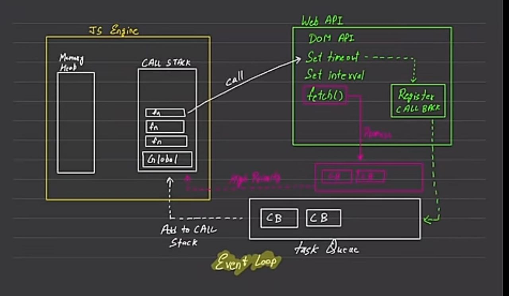

# Async 

### JavaScript 
- Synchronous (dafault javascript)
- Single Threaded (default javascript)

### Execution Content
- execute one line of  code at a time
- Each operation waits for the last one to complete before executing
- console log 1
- console log 2
- **CALL STACK** 
- **MEMORY HEAP**

### Blocking Code vs Non-Blocking Code
Blocking Code 
- Block the flow of Program
- Read File Sync

Non-Blocking Code
- Does not block execution
- Read File Async

